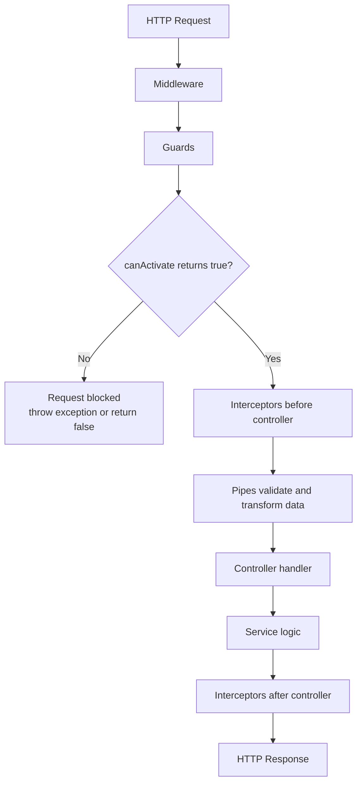
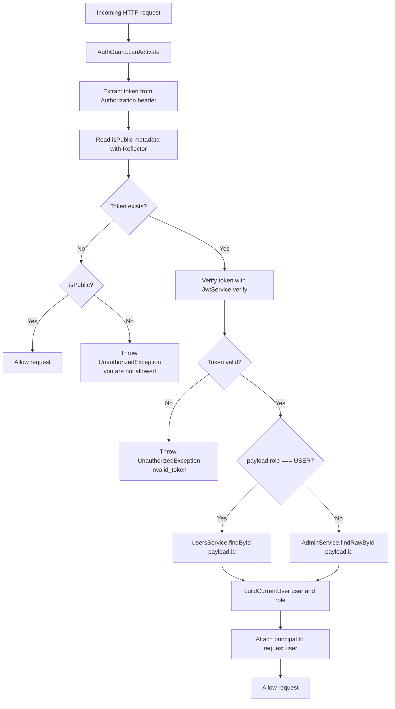

## High Level Design For Auth Guard Implementation

## How Guards Work In NestJS

This diagram explains the general NestJS request lifecycle and where guards fit.

### Simple Explanation

1. Middleware runs first.
2. Guards run before the controller method executes.
3. A guard decides whether the request can continue.
4. If `canActivate()` returns `true`, Nest continues the request lifecycle.
5. If `canActivate()` returns `false` or throws an exception, the request stops there.
6. After guards pass, pipes, interceptors, and the controller continue normally.

### Guard Responsibility In One Sentence

A NestJS guard is the framework layer that answers: "Should this request be allowed to reach this route handler?"

## Flow Diagram

## Teaching Script

1. Every request enters `canActivate()`.
2. The guard tries to read the token from `Authorization: Bearer <token>`.
3. The guard checks whether the route is marked with `@Public()`.
4. If there is no token and the route is not public, the request is rejected immediately.
5. If a token exists, the guard verifies it.
6. After verification, the guard reads the role from the payload.
7. If the role is `user`, it loads the user from `UsersService`.
8. Otherwise, it loads the admin from `AdminService`.
9. The guard builds a normalized `request.user` object so the rest of the app can use the same shape.
10. If anything fails during verification or lookup, the guard throws `invalid_token`.