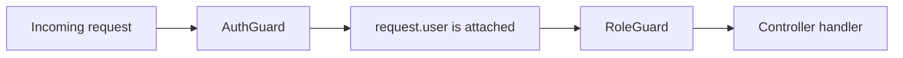
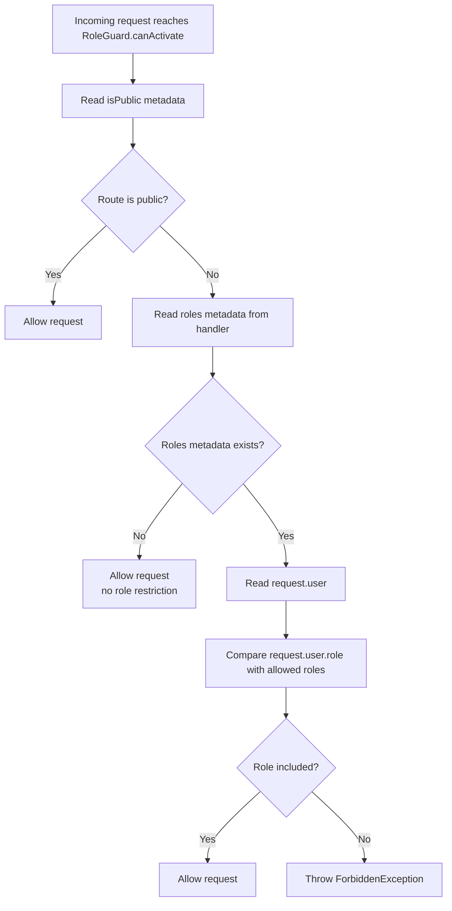

# RoleGuard Visual Explanation

Use this diagram to explain how `src/auth/guards/role.guard.ts` performs authorization after `AuthGuard` finishes authentication.

## How RoleGuard Fits In

`RoleGuard` does not verify JWTs.  
It assumes `AuthGuard` already authenticated the request and attached `request.user`.

## RoleGuard Flow Diagram

