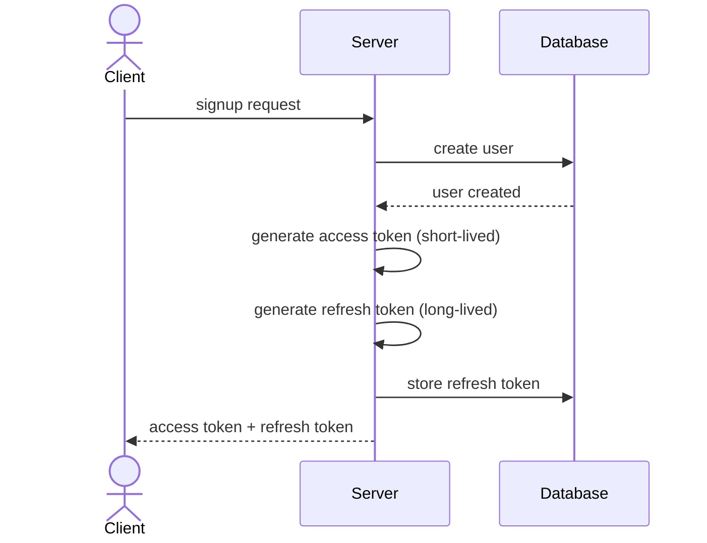
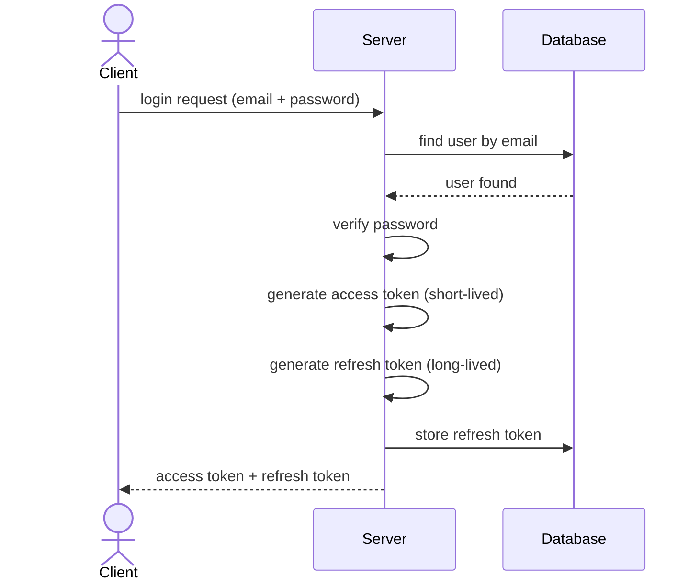
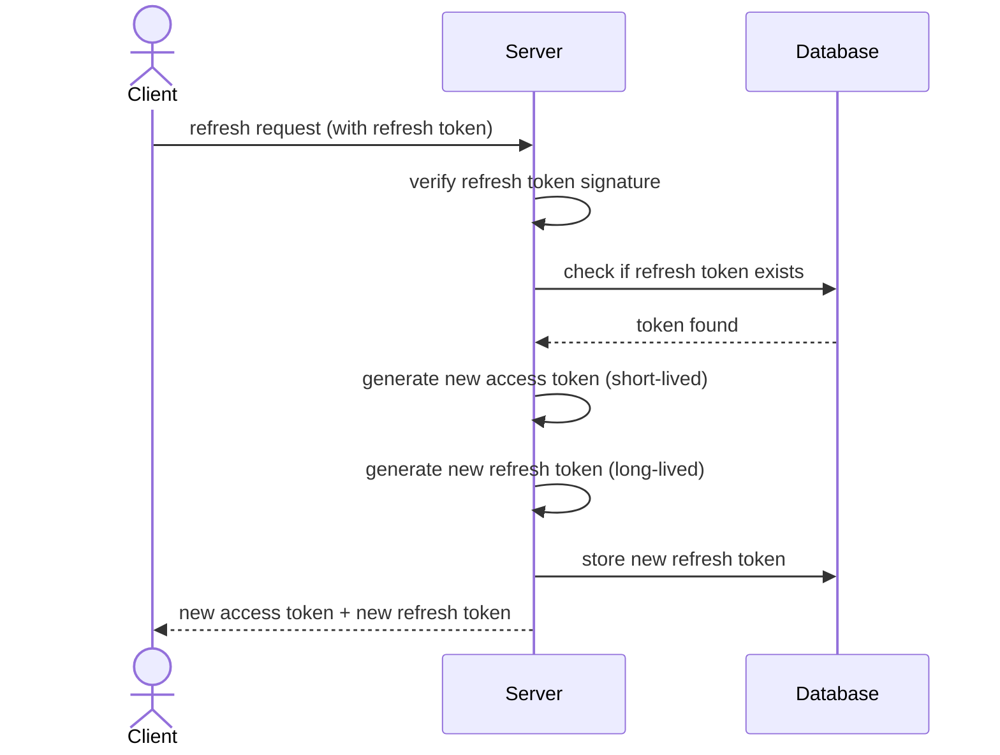

# Refresh Token Implementation Guide

## Why We Use Refresh Tokens

Refresh tokens solve a common authentication problem:

- access tokens should be short-lived for better security
- but users should not be forced to log in again every few minutes

So the common approach is:

- issue a short-lived access token
- issue a longer-lived refresh token
- when the access token expires, use the refresh token to get a new token pair

### Main Benefits of Refresh Tokens

- better security because the access token can expire quickly
- better user experience because the user can stay logged in without signing in again
- better control because the backend can decide when to issue a new token pair

## Storing Refresh Tokens in the Database vs Not Storing Them

There are two common ways to build refresh-token authentication.

### Option 1: Do Not Store Refresh Tokens in the Database

In this approach:

- the backend only verifies the refresh token signature and expiration
- if the token is valid, the backend accepts it

Benefits:

- simpler implementation
- fewer database queries
- fully stateless authentication flow

Limitations:

- hard to revoke a refresh token before it expires
- hard to log out a user from the server side
- if a refresh token is leaked, it may remain usable until expiration

### Option 2: Store Refresh Tokens in the Database

In this approach:

- the backend verifies the JWT
- then it also checks whether that token exists in the database

Benefits:

- you can revoke tokens by deleting them from the database
- old tokens can become invalid immediately
- logout becomes more meaningful because the server can remove the stored token
- you can keep better control over active sessions

Tradeoff:

- each refresh request needs a database lookup
- implementation is a little more complex than a fully stateless approach

## Signup Lifecycle Diagram

This diagram shows how refresh tokens are created during signup.

## Login Lifecycle Diagram

This diagram shows how refresh tokens are created during login.

## Refresh Token Flow Diagram

This diagram shows how refresh tokens are used to get new access tokens.

