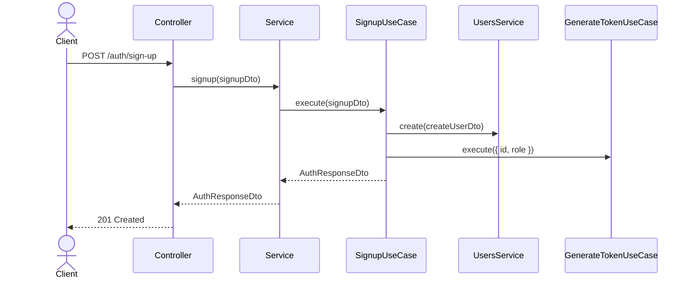

# Use Case Pattern Guide

## What is the Use Case Pattern

The use case pattern is a way to organize business logic into small, focused classes.

Instead of putting all logic inside a service, each action in the system gets its own use case class.

Examples:
- `SignupUseCase`
- `LoginUseCase`
- `RefreshTokenUseCase`

Each use case should have one clear responsibility.

## Why We Use It

Without this pattern, service files usually become large and hard to maintain.

With the use case pattern:
- controllers stay responsible for HTTP only
- services stay thin and only delegate
- business logic lives in dedicated use cases
- code becomes easier to test and reuse

## Architecture

This project follows this flow:

```text
Controller
  -> Service
  -> Use Case
  -> Repository
  -> Database
```

### Responsibility of each layer

**Controller**
- receives the request
- validates input DTOs
- calls the service

**Service**
- delegates to the correct use case
- should contain little to no business logic

**Use Case**
- contains the business logic
- coordinates repositories and other use cases
- returns a response DTO

**Repository**
- handles data access only

## Example: Signup Flow

This is a simple example of how the pattern works.

### Flow Diagram

