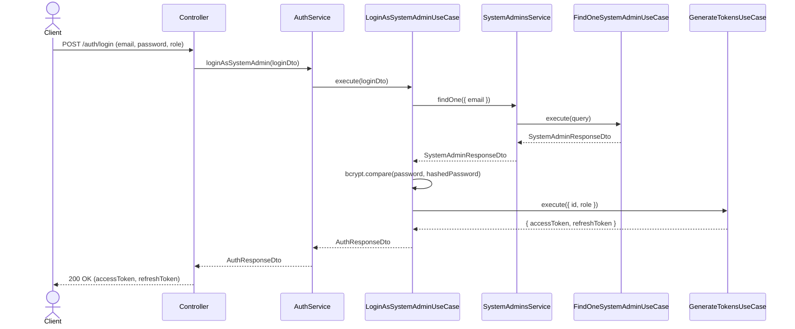

# System Admin Login Flow

## Sequence Diagram

```mermaid
sequenceDiagram
    actor Client
    participant Controller
    participant AuthService
    participant LoginAsSystemAdminUseCase
    participant SystemAdminsService
    participant FindOneSystemAdminUseCase
    participant GenerateTokensUseCase

    Client->>Controller: POST /auth/login (email, password, role)
    Controller->>AuthService: loginAsSystemAdmin(loginDto)
    AuthService->>LoginAsSystemAdminUseCase: execute(loginDto)
    LoginAsSystemAdminUseCase->>SystemAdminsService: findOne({ email })
    SystemAdminsService->>FindOneSystemAdminUseCase: execute(query)
    FindOneSystemAdminUseCase-->>SystemAdminsService: SystemAdminResponseDto
    SystemAdminsService-->>LoginAsSystemAdminUseCase: SystemAdminResponseDto
    LoginAsSystemAdminUseCase->>LoginAsSystemAdminUseCase: bcrypt.compare(password, hashedPassword)
    LoginAsSystemAdminUseCase->>GenerateTokensUseCase: execute({ id, role })
    GenerateTokensUseCase-->>LoginAsSystemAdminUseCase: { accessToken, refreshToken }
    LoginAsSystemAdminUseCase-->>AuthService: AuthResponseDto
    AuthService-->>Controller: AuthResponseDto
    Controller-->>Client: 200 OK (accessToken, refreshToken)
```
